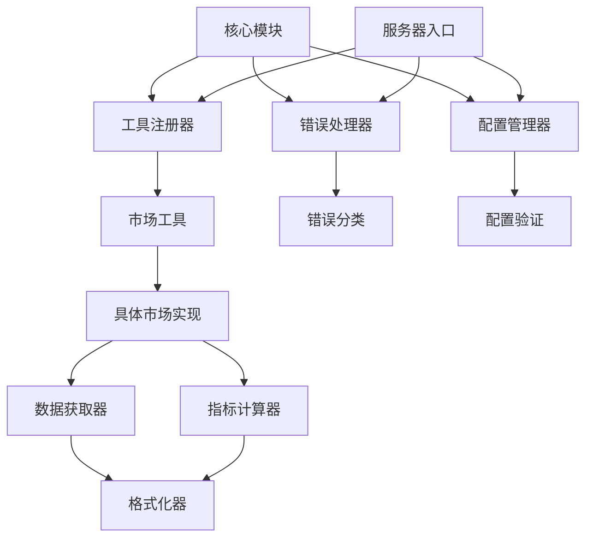

# FinanceMCP 架构优化计划

## 1. 整体架构设计

### 1.1 新的目录结构

```
src/
├── core/
│   ├── tool-registry.ts          # 通用工具注册器
│   ├── error-handler.ts          # 统一错误处理
│   └── config-manager.ts         # 配置管理器
├── tools/
│   ├── base/
│   │   ├── tool.interface.ts     # 工具接口定义
│   │   ├── market-tool.abstract.ts # 市场工具抽象基类
│   │   └── formatter.abstract.ts # 格式化器抽象基类
│   ├── markets/
│   │   ├── cn-market.ts          # A股市场工具
│   │   ├── us-market.ts          # 美股市场工具
│   │   ├── hk-market.ts          # 港股市场工具
│   │   ├── crypto-market.ts      # 加密货币市场工具
│   │   ├── fx-market.ts          # 外汇市场工具
│   │   ├── futures-market.ts     # 期货市场工具
│   │   ├── fund-market.ts        # 基金市场工具
│   │   ├── repo-market.ts        # 债券逆回购市场工具
│   │   ├── convertible-bond-market.ts # 可转债市场工具
│   │   └── options-market.ts     # 期权市场工具
│   ├── formatters/
│   │   ├── markdown-formatter.ts # Markdown格式化器
│   │   ├── csv-formatter.ts      # CSV格式化器
│   │   ├── json-formatter.ts     # JSON格式化器
│   │   └── stock-formatter.ts    # 股票数据格式化器
│   ├── indicators/
│   │   ├── macd-indicator.ts     # MACD指标计算器
│   │   ├── rsi-indicator.ts      # RSI指标计算器
│   │   ├── kdj-indicator.ts      # KDJ指标计算器
│   │   ├── boll-indicator.ts     # 布林带指标计算器
│   │   └── ma-indicator.ts       # 移动平均线计算器
│   ├── utils/
│   │   ├── data-validator.ts     # 数据验证器
│   │   ├── export-manager.ts     # 导出管理器
│   │   └── date-utils.ts         # 日期工具类
│   ├── stockData.ts              # 重构后的主入口（瘦身版）
│   └── [其他现有工具].ts
├── common/
│   ├── types.ts                  # 通用类型定义
│   ├── constants.ts              # 常量定义
│   └── errors.ts                 # 错误码定义
├── config/
│   ├── index.ts                  # 主配置文件
│   ├── validation.ts             # 配置验证
│   └── defaults.ts               # 默认配置
└── servers/
    ├── index.ts                  # Stdio服务器入口
    └── httpServer.ts             # HTTP服务器入口
```

### 1.2 核心类和接口定义

```typescript
// 工具接口定义
export interface Tool {
  name: string;
  description: string;
  parameters: Record<string, any>;
  run(args: any): Promise<ToolResult>;
}

export interface ToolResult {
  content: Array<{
    type: string;
    text: string;
  }>;
  isError?: boolean;
}

// 市场工具抽象基类
export abstract class MarketTool {
  abstract readonly marketType: string;
  abstract readonly apiName: string;

  async fetchData(params: MarketDataParams): Promise<any[]> {
    // 通用数据获取逻辑
  }

  async calculateIndicators(data: any[], indicators: string[]): Promise<IndicatorResult> {
    // 通用指标计算逻辑
  }

  formatOutput(data: any[], format: string): string {
    // 通用格式化逻辑
  }
}

// 错误处理接口
export interface ErrorHandler {
  handle(error: Error, context?: Record<string, any>): ErrorResponse;
  isRetryable(error: Error): boolean;
  log(error: Error, context?: Record<string, any>): void;
}

// 配置管理接口
export interface ConfigManager {
  get<T>(key: string): T;
  set<T>(key: string, value: T): void;
  validate(): boolean;
  reload(): Promise<void>;
}
```

### 1.3 模块依赖关系图



## 2. 具体实施步骤

### Phase 1: 创建通用工具管理器 (预计工时: 8小时)

#### 步骤1.1: 创建核心接口和类型定义
**文件级别变更：**
- 创建 `src/core/interfaces.ts` - 定义核心接口
- 创建 `src/common/types.ts` - 定义通用类型
- 创建 `src/common/constants.ts` - 定义常量

**具体操作：**
1. 定义 `Tool` 接口，统一所有工具的标准
2. 定义 `MarketTool` 抽象基类，提供通用功能
3. 定义错误处理相关类型
4. 定义配置管理相关类型

#### 步骤1.2: 创建工具注册器
**文件级别变更：**
- 创建 `src/core/tool-registry.ts` - 核心工具注册器

**核心功能：**
1. 集中管理所有工具的注册
2. 提供统一的工具列表生成
3. 支持工具的动态加载和卸载
4. 统一的工具执行路由

#### 步骤1.3: 重构服务器入口文件
**文件级别变更：**
- 重构 `src/servers/index.ts` - 移除重复代码
- 重构 `src/servers/httpServer.ts` - 移除重复代码

**重构要点：**
1. 移除硬编码的时间戳工具定义
2. 使用通用工具注册器获取工具列表
3. 统一工具执行逻辑
4. 保持向后兼容性

### Phase 2: 拆分大文件 (预计工时: 16小时)

#### 步骤2.1: 创建市场工具基类
**文件级别变更：**
- 创建 `src/tools/base/market-tool.abstract.ts`
- 创建 `src/tools/base/formatter.abstract.ts`

#### 步骤2.2: 按市场类型拆分stockData.ts
**文件级别变更：**
- 创建 `src/tools/markets/cn-market.ts` (300行)
- 创建 `src/tools/markets/us-market.ts` (200行)
- 创建 `src/tools/markets/hk-market.ts` (200行)
- 创建 `src/tools/markets/crypto-market.ts` (250行)
- 创建 `src/tools/markets/fx-market.ts` (150行)
- 创建 `src/tools/markets/futures-market.ts` (150行)
- 创建 `src/tools/markets/fund-market.ts` (120行)
- 创建 `src/tools/markets/repo-market.ts` (100行)
- 创建 `src/tools/markets/convertible-bond-market.ts` (150行)
- 创建 `src/tools/markets/options-market.ts` (150行)

#### 步骤2.3: 提取技术指标计算器
**文件级别变更：**
- 创建 `src/tools/indicators/macd-indicator.ts`
- 创建 `src/tools/indicators/rsi-indicator.ts`
- 创建 `src/tools/indicators/kdj-indicator.ts`
- 创建 `src/tools/indicators/boll-indicator.ts`
- 创建 `src/tools/indicators/ma-indicator.ts`

#### 步骤2.4: 提取格式化器
**文件级别变更：**
- 创建 `src/tools/formatters/markdown-formatter.ts`
- 创建 `src/tools/formatters/csv-formatter.ts`
- 创建 `src/tools/formatters/json-formatter.ts`
- 创建 `src/tools/formatters/stock-formatter.ts`

#### 步骤2.5: 重构主stockData.ts文件
**文件级别变更：**
- 重构 `src/tools/stockData.ts` (减少至200行)

### Phase 3: 统一错误处理 (预计工时: 6小时)

#### 步骤3.1: 创建错误处理核心类
**文件级别变更：**
- 创建 `src/core/error-handler.ts` - 统一错误处理器
- 创建 `src/common/errors.ts` - 错误码定义

#### 步骤3.2: 定义错误分类体系
**错误类型：**
1. **ValidationError** - 参数验证错误
2. **ApiError** - API调用错误
3. **NetworkError** - 网络连接错误
4. **DataFormatError** - 数据格式错误
5. **BusinessError** - 业务逻辑错误

#### 步骤3.3: 重构现有错误处理
**文件级别变更：**
- 重构所有工具文件的错误处理逻辑
- 统一错误消息格式
- 添加错误上下文信息

### Phase 4: 配置管理改进 (预计工时: 4小时)

#### 步骤4.1: 创建配置管理器
**文件级别变更：**
- 创建 `src/core/config-manager.ts` - 配置管理器
- 创建 `src/config/validation.ts` - 配置验证
- 创建 `src/config/defaults.ts` - 默认配置

#### 步骤4.2: 提取硬编码配置
**识别的硬编码项：**
1. API URL和超时时间
2. 错误消息模板
3. 格式化模板
4. 常量值

#### 步骤4.3: 添加配置验证和热重载
**增强功能：**
1. 配置文件格式验证
2. 配置值的类型检查
3. 开发环境配置热重载
4. 配置变更监控

## 3. 代码示例

### 3.1 通用工具管理器使用示例

```typescript
import { ToolRegistry } from '../core/tool-registry';
import { StockDataTool } from '../tools/stockData';

// 注册工具
const toolRegistry = new ToolRegistry();
toolRegistry.register('stock_data', new StockDataTool());

// 获取工具列表
const toolsList = toolRegistry.getToolsList();

// 执行工具
const result = await toolRegistry.executeTool('stock_data', {
  code: '000001.SZ',
  market_type: 'cn'
});
```

### 3.2 市场工具抽象基类示例

```typescript
export abstract class MarketTool {
  protected abstract marketType: string;
  protected abstract apiName: string;

  async run(params: MarketDataParams): Promise<ToolResult> {
    try {
      // 1. 验证参数
      this.validateParams(params);

      // 2. 获取数据
      const data = await this.fetchData(params);

      // 3. 计算技术指标
      const indicators = await this.calculateIndicators(data, params.indicators);

      // 4. 格式化输出
      const formatted = this.formatOutput(data, indicators, params.format);

      return { content: [{ type: 'text', text: formatted }] };
    } catch (error) {
      // 统一错误处理
      return this.errorHandler.handle(error, { marketType: this.marketType });
    }
  }
}
```

### 3.3 统一错误处理示例

```typescript
import { ErrorHandler, ErrorCodes } from '../core/error-handler';

export class FinanceErrorHandler implements ErrorHandler {
  handle(error: Error, context?: Record<string, any>): ErrorResponse {
    const errorCode = this.classifyError(error);

    return {
      code: errorCode,
      message: this.getErrorMessage(errorCode, error),
      details: context,
      timestamp: new Date().toISOString(),
      retryable: this.isRetryable(error)
    };
  }

  private classifyError(error: Error): ErrorCodes {
    if (error.message.includes('API')) return ErrorCodes.API_ERROR;
    if (error.message.includes('网络')) return ErrorCodes.NETWORK_ERROR;
    if (error.message.includes('参数')) return ErrorCodes.VALIDATION_ERROR;
    return ErrorCodes.UNKNOWN_ERROR;
  }
}
```

### 3.4 配置管理示例

```typescript
import { ConfigManager } from '../core/config-manager';

const config = new ConfigManager();

// 读取配置
const apiUrl = config.get<string>('tushare.apiUrl');
const timeout = config.get<number>('api.timeout');

// 修改配置
config.set('api.timeout', 45000);

// 验证配置
if (!config.validate()) {
  throw new Error('配置验证失败');
}
```

## 4. 迁移策略

### 4.1 平滑过渡方案

#### 第一阶段：并行运行 (1周)
1. 新架构与旧架构并行开发
2. 核心功能在新架构中实现
3. 保持旧接口不变，确保向后兼容

#### 第二阶段：逐步切换 (2周)
1. 逐个模块迁移到新架构
2. 每个模块迁移后进行充分测试
3. 监控新架构的性能和稳定性

#### 第三阶段：完全切换 (1周)
1. 移除旧架构代码
2. 清理废弃文件
3. 性能优化和代码重构

### 4.2 向后兼容性考虑

#### 接口兼容性
- 保持所有现有工具的API接口不变
- 新增功能采用可选参数的形式添加
- 错误响应格式保持兼容

#### 数据兼容性
- 新架构产生的数据格式与旧架构完全一致
- 文件导出格式保持不变
- API响应格式维持现有标准

### 4.3 回滚方案

#### 快速回滚机制
1. 保留旧版本代码的备份
2. 设计特征开关，快速切换到旧版本
3. 监控关键指标，异常时自动回滚

#### 风险控制措施
1. 小规模用户群体验证
2. 灰度发布策略
3. 完善的监控和告警机制

## 5. 实施风险评估

### 5.1 技术风险

| 风险项 | 概率 | 影响 | 缓解措施 |
|--------|------|------|----------|
| 新架构性能下降 | 中 | 高 | 性能基准测试，必要时优化 |
| 兼容性问题 | 高 | 中 | 充分的兼容性测试，渐进式迁移 |
| 第三方依赖变更 | 低 | 高 | 抽象依赖接口，降低耦合度 |

### 5.2 实施风险

| 风险项 | 概率 | 影响 | 缓解措施 |
|--------|------|------|----------|
| 迁移期间服务中断 | 中 | 高 | 并行运行，蓝绿部署 |
| 团队技能不足 | 低 | 中 | 代码审查，结对编程 |
| 时间估算偏差 | 高 | 中 | 敏捷开发，分阶段验收 |

### 5.3 业务风险

| 风险项 | 概率 | 影响 | 缓解措施 |
|--------|------|------|----------|
| 用户体验退化 | 低 | 高 | 用户体验测试，快速反馈 |
| 数据准确性问题 | 中 | 高 | 数据验证，多重校验 |
| 功能不可用 | 低 | 高 | 降级策略，兜底方案 |

## 6. 质量保证计划

### 6.1 测试策略

#### 单元测试
- 每个模块的单元测试覆盖率 > 80%
- 关键算法的边界条件测试
- 错误处理路径的测试覆盖

#### 集成测试
- 模块间接口的集成测试
- 完整业务流程的端到端测试
- 第三方API集成的测试

#### 性能测试
- 大数据量处理性能测试
- 并发请求处理能力测试
- 内存泄露检测

### 6.2 监控指标

#### 系统指标
- 响应时间 P95 < 2秒
- 错误率 < 0.1%
- CPU使用率 < 70%
- 内存使用率 < 80%

#### 业务指标
- API调用成功率 > 99.9%
- 数据处理准确率 = 100%
- 文件导出成功率 > 99.5%

## 7. 总结

本优化计划通过模块化拆分、统一管理、错误处理标准化等手段，解决了当前架构中的主要问题：

1. **消除代码重复**：通过通用工具管理器统一工具注册和执行逻辑
2. **降低文件复杂度**：将1360行的巨型文件拆分为职责单一的小文件
3. **统一错误处理**：建立标准的错误分类和处理机制
4. **改进配置管理**：集中管理配置，提高可维护性

预计总工时约34小时，分4个阶段实施，每阶段都有明确的可交付成果和质量检查点，确保优化工作的顺利进行和高质量完成。